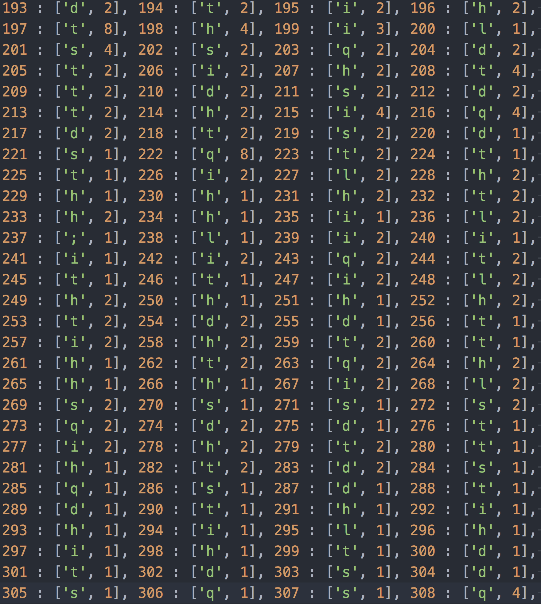

# Keyboard Warrior

## Game Instructions

**Press the right key on the keyboard when the falling circular note is in the middle of its corresponding white circle.**

## Technologies Used

- HTML 5 (with HTML audio)
- CSS 3 (with animations)
- JavaScript (no libraries)
- Google Fonts
- Git & GitHub
- Pro Tools 11
- Sibelius 7

## Approach Taken

The basic premise of this rhythm game has already been explored in numerous existing games, but I set out to create the added complextiy of mimicking a piano keyboard with the QWERTY keyboard layout, as though overlaying a piano keyboard on top of the QWERTY keyboard and finding where the keys correspond. This included incorporating 24 different key strokes, specifically `Q`, `A`, `W`, `E`, `D`, `F`, `T`, `G`, `Y`, `H`, `J`, `I`, `K`, `O`, `L`, `P` ,`;` ,`'` , and `]`, far more than the average rhythm game. This added complexity allowed for the experience of playing the game to be more similar to the experience of playing a real instrument, since whereas in a typical rhythm game, like Guitar Hero, the notes produced have an arbitrary relationship with the key pressed, the letters on the keyboard in Keyboard Warrior are 1:1 mapped to their corresponding notes on the piano.

The synchronisation between the music and the player is such that the player is playing the melody of the song whilst an especially synthesised music plays in the background. The music needed to be custom-created due to needing to absolutely sync the BPM between the background music and the notes as they fall, since any discrepancy in the rhythm, even as small as 50 milliseconds, could be detectable by the player and render the game unplayable. The following images show the process of creating custom music.

The most nuanced aspect of the game is which notes played by the player should be considered "right" and which ones "wrong". Since it would basically be impossible to hit the key on the exact millisecond on which that note should be correct, or even within the nearest 50 milliseconds, there needed to be a "window" around the correct timing of the note in which the player could hit the note and still be considered "right". After a lot of experimenting, I have decided that in faster, more difficult songs where the notes were closer together, this "correctness window" could be as small as 100 milliseconds, whereas in easier songs where the notes are slower, this "correctness window" can be as long as 500 milliseconds. These values are calculated automatically in JavaScript depending on the speed of the song inputted. In other words, in reality the player needn't hit the key when the note is exactly at the center of its white circle, since that would be statistically nearly impossible - instead, there is a small margin around the white circle in which the player's key stroke would still be considered "correct", though this is visually undetectable except in the slowest, easiest songs. A satisfying animation is played when the player gets the note right.

If the game only visually rewarded the player for getting the notes "right", it will be fairly unfulfilling and somewhat infuriating if the player hit a note *almost* right, but the game didn't acknowledge it. For this reason, around the "correctness window" there is a window for when the player plays the note *almost* on time. If a player gets a note almost right, the note changes colour, but does not play a satisfying animation.

An oddity in the creation of this game in particular lead to one of the most repetitive parts of the development process: inputting every single note of every single song as keystroke-duration pairs. This lead to the creation of enormous objects, of which the following is an excerpt. This object is used to create the timing and key presses for the falling notes.

